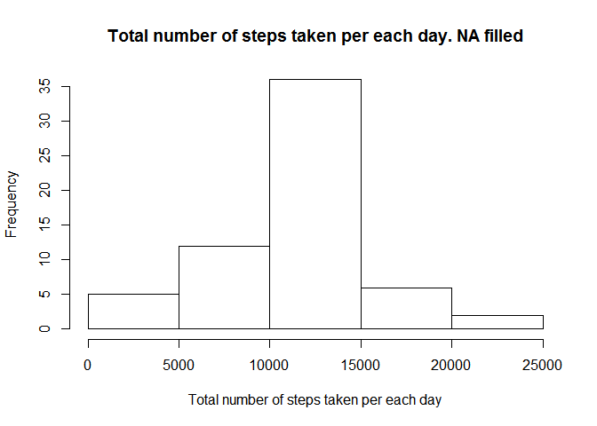

# Reproducible Research: Peer Assessment 1
Eduardo Garcia  

## Loading and preprocessing the data


```r
unzip(zipfile = "activity.zip")

data <- read.csv("activity.csv", header=TRUE)
```

## What is mean total number of steps taken per day?

For this part of the assignment we can ignore the missing values in the dataset.


```r
clean_data <- data[which(data$steps != "NA"), ]
```

First we calculate the total number of steps taken per day and then we represent
the result in a histogram. There are three main differences between histograms 
and barplots:

* Histograms are used to show distributions of variables while bar charts are 
used to compare variables. 
* Histograms plot binned quantitative data while bar charts plot categorical 
data. 
* Bars can be reordered in bar charts but not in histograms.


```r
library(plyr)

total_steps_by_day <- ddply(clean_data, .(date), summarise, steps = sum(steps))

hist(total_steps_by_day$steps, 
     main = "Total number of steps taken per each day. NA ignored",
     xlab = "Total number of steps taken per each day",
     ylab = "Frequency")
```

<!-- -->

Finally we calculate the mean and median of the total number of steps taken per 
day.


```r
mean(total_steps_by_day$steps)
```

```
## [1] 10766.19
```

```r
median(total_steps_by_day$steps)
```

```
## [1] 10765
```

## What is the average daily activity pattern?

This time series plot represents the 5-minute interval (x-axis) and the average 
number of steps taken, averaged across all days (y-axis):


```r
average_steps_by_interval <- 
  ddply(clean_data, .(interval), summarise, steps = mean(steps))

plot(average_steps_by_interval$interval, 
     average_steps_by_interval$steps, 
     type = "l", 
     main = "Average daily activity pattern",
     xlab="5-minute interval", 
     ylab="Average number of steps")
```

<!-- -->

The 5-minute interval that contains the maximum number of steps on average 
across all the days is:


```r
average_steps_by_interval[
  average_steps_by_interval$steps == max(average_steps_by_interval$steps),]
```

```
##     interval    steps
## 104      835 206.1698
```


## Imputing missing values

The presence of missing days may introduce bias into some calculations or 
summaries of the data.

The total number of missing values in the dataset (i.e. the total number of rows 
with NAs) is calculated as follows:


```r
sum(is.na(data$steps))
```

```
## [1] 2304
```

In order to fill all of the missing values in the dataset, we use the mean for 
that 5-minute interval. As a result we have a new dataset that is equal to the 
original dataset but with the missing data filled in.


```r
colnames(average_steps_by_interval)[2] <- "intervalAverage"

filled_data <- arrange(join(data, average_steps_by_interval), interval)
```

```
## Joining by: interval
```

```r
filled_data$steps[is.na(filled_data$steps)] <- 
  filled_data$intervalAverage[is.na(filled_data$steps)]
```

In the following block we plot the histogram of the total number of steps taken 
each day: 


```r
filled_total_steps_by_day <- 
  ddply(filled_data, .(date), summarise, steps = sum(steps))

hist(filled_total_steps_by_day$steps,
     main = "Total number of steps taken per each day. NA filled",
     xlab = "Total number of steps taken per each day",
     ylab = "Frequency")
```

<!-- -->

Finally we calculate the mean and median of the total number of steps taken per 
day with the filled data.


```r
mean(filled_total_steps_by_day$steps)
```

```
## [1] 10766.19
```

```r
median(filled_total_steps_by_day$steps)
```

```
## [1] 10766.19
```

As expected, the mean and the median values are higher after inputing the 
missing values than when we ignored them. When the `NA`values were ignored, we
assumed 0 steps for that value, while with the inputing strategy they were 
filled with the average of that 5-minutes interval, which could be greater than
0 in may cases.

## Are there differences in activity patterns between weekdays and weekends?

First with the `weekdays()` function we obtain the weekdays from the dataset and
then we add a factor variable to the dataset with the type of day ("weekday or 
weekend"):


```r
weekdays <- weekdays(as.Date(filled_data$date))

weekdays_data <- transform(filled_data, day = weekdays)

# Adding a factor variable with "weekend" or "weekday" value, accordingly
weekdays_data$day_type <- 
  ifelse(weekdays_data$day %in% c("domingo", "sabado"), "weekend", "weekday")

average_by_interval_day_type <- 
  ddply(weekdays_data, 
        .(interval, day_type), 
        summarise, steps = mean(steps))
```

Finally to visualize the differences in activity patterns between weekdays and 
weekends we create a panel plot containing a time series plot of the 5-minute 
interval (x-axis) and the average number of steps taken, averaged across all 
weekday days or weekend days (y-axis). 


```r
library(lattice)

xyplot(steps ~ interval | day_type,
       data = average_by_interval_day_type,
       layout = c(1, 2), type="l")
```

<!-- -->
